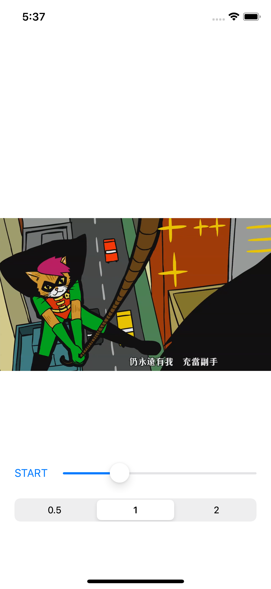

# HPlayer


该播放器基于FFMppeg进行流解析、软解处理，VideoToolBox硬解，Metal渲染视频，AudioUnit渲染音频。实现了常见播放器的开关播放、自动、循环、倍速播放、滑动进度、播放缓冲、码流自适应等功能。作为音视频学习总结项目，其中某些处理思想主要参考[SGPlayer](https://github.com/libobjc/SGPlayer)

# 整体设计
每个层次和对应的处理模块都通过protocol进行抽象，都可以进行单独插拔替换和实现，主要构成为：
* Layer层：管理控制播放相关功能，完成展示。
* Player层：播放器核心封装，持有对应的资源source和音视频渲染对象audioOutput、videoOutput。
* Source层：FFMpeg处理的url资源描述类，主要工作是
	* 打开流并开启read packet循环，然后送到解码模块。
	* 同时作为track的代理响应解码前后packet和frame的变化。
	* 也作为音视频数据渲染的renderSource对象、track的中间代理类，从track的renderQueue中取出解码后的frame送到对应的音视频output对象渲染循环内进行渲染。
* Track：对于流的描述类，内部持有解码模块中的软硬解码器、重采样对象，收集编解码前后数据的packetQueue和renderQueue。
* AudioOutput：音频渲染对象，内部持有AudioPlayer对象用于音频播放，AudioPlayer实现通过AudioUnit。
* VideoOutput：视频渲染对象，实际是MTKView的子类进行Metal画面渲染。

# 处理概述
1. layer层设置url后会初始化player。
2. player层初始化时进行source、frameOutput （videoOutput和videoOutput）等的初始化，并且设置frameOutput的renderSource代理为source进而向source索要渲染循环内需要的音视频数据，同时设置source的delegate为player，来响应source层的处理状态变化。
3. player初始化后layer层把player的view抽象对象作为subview添加到视图上用于显示，接着依次触发layer、player、source层的prepareToPlay准备开始播放。
4. source层遵循播放协议，实现了prepareToPlay、shutdown、seek等必要的播放动作。
5. source层prepareToPlay时进行open操作打开资源文件，检索并提取流和资源信息包成一条条track对象，source还会作为track的delegate响应track内codec的变化处理（track对象内部通过queue管理存储解码前后的packet和frame对象和对应的解码模块）。
6. 然后source层open资源后，通过delegate把didOpen通知到player层在主线程开启（一开始只开视频用于预览）FrameOutput的渲染循环。（循环内部会调用到source层去取对应的video和audio frame数据，open时肯定取不到不会有渲染效果）。接着player的isPreparedToPlay标记为true，表示准备完成可以播放了，然后也会把preparedToPlay时机通过delegate告诉layer层。
7. 紧接着source层read操作开始，在read循环开始读取packet前先拿出track触发decode操作，track内会新起一条decode线程进行decode循环，decode循环不断从packetQueue中取出packet送去解码模块解码。decode循环在没有取到packet的情况下也会不断continue的循环尝试去取，直到手动取消decodeOperation或者EndOfFile。
8. 开启track内的decode循环后，接着source开启进入read循环，read循环内在reading状态下在read线程从source中循环读取packet后送入对应track的packetQueue中。
9. 接着先前track内的decode循环不断进行packet的解码处理，拿到frame后送入renderQueue中保存。
10. player层通过play、pause操作控制持有的FrameOutput对象渲染循环的开关，开启后source层作为FrameOutput渲染输出对象的代理，则根据type（音频还是视频）去对应的track的renderQueue中带上predicate（音视频事件同步处理机制）取decode后的frame用于渲染。

# 播放控制
### 开始播放和暂停播放
1. 首先layer层的play方法会校验player的isPreparedToPlay，通过后触发player的play，pause直接触发player的pause。
2. player的play或者pause方法会修改playbackState状态为playing或者pause，每次playbackState变化时会去触发渲染循环的开启或者暂停从而实现开始播放或者暂停播放。
3. 由于一开始就会开启视频渲染去预览画面，所以最终其实是开启或暂停音频的渲染循环，音频渲染循环的开启或者暂停依赖是`self.playbackState == .playing && self.loadState == .playable`，也就是需要依赖source层告诉player它的loadState状态，如果play动作发生时loadState不是playable，那么不会马上开启，而是等到player持续收到source层sourceDidChange消息带过来的LoadingState的isPlayable为true时，会更新player内部的loadState变化为playable，player的loadState变化也会尝试重新去开启或者暂停渲染循环。
4. 播放时要打开防止熄屏，完成后停掉。

### 自动播放
Layer收到player的preparedToPlay消息时，会检查autoplay是否为true，从而触发自动play。同时在layer层进行play或者pause时也会更新autoplay状态，防止暂停后又自动播放的问题。

### 循环播放
1. source里read线程通过`av_read_frame`读取packet时如果错误码是`AVERROR_EOF`的话说明读取到了资源的末尾，会检查`options.isLoopPlay`是否支持循环播放，通过后触发修改track的isLoopModel标记为true。
2. read线程检查到`options.isLoopPlay`为true的话，会调用`av_seek_frame`把ffmpeg的read位置位置修改为0时间。
3. 然后read操作结束，source的state = .finished。
4. 在read线程read packet循环结束后，最终修改track的isEndOfFile为true，当decode线程decode时检查到`isEndOfFile && packetQueue.count == 0`时decode才会结束，state == finish。
5. 当decode结束之后，渲染循环去track的outputRenderQueue取遗留的frame时，如果取不到并且`state == .finished, frameCount == 0`说明已经没有frame送出去渲染了，此时渲染循环结束。
6. 渲染结束后track通过codecDidFinished告知source，sources会检查所有的track内`let allSatisfy = videoAudioTracks.allSatisfy { $0.isEndOfFile && $0.frameCount == 0 && $0.packetCount == 0 }`状态，接着通过sourceDidFinished告知player层，为true表示音频和视频的渲染都停止了的情况，并且此时`options.isLoopPlay`为true的话会重新开始read操作进行packet的读取。
	1. player收到sourceDidFinished结束后，如果allSatisfy为false则先停掉对应的音频或视频渲染循环，如果allSatisfy为true表示音视频都播放完成并且`options.isLoopPlay`为true的话就重新开启audioOutput和videoOutput的渲染循环。
	2. 接着source开始重新read后又会接收到codecDidChangeCapacity变化，处理成loadingState后通过sourceDidChange告知给player，继续进度的处理，完成循环播放。

整个停止过程，先停read、再停decode、最后停渲染、音视频渲染都停完的情况下需要循环播放时又开启音视频的渲染循环。

### seeking拖动处理
1. 网络播放时，要注意seek时，可能player还没打开流isPreparedToPlay准备好，所以在对layer进行seek时如果isPreparedToPlay为false就保存一下`shouldSeekTo = time`时间，然后layer收到player的preparedToPlay消息时，发现shouldSeekTo大于0，就再重新seek一次。
2. player的seek处理先对time做了适配处理，如果time大于等于资源本身总时长并且循环播放是开启的话，重新把time换为0。然后对audioOutput做clear，清除当前渲染的音频桢此时变为无声，最后触发source的seek。
3. source进行seek处理时根据当前state分为2种情况：
	1. 当paused状态时，先修改state = .seeking，然后条件锁发送broadcast消息尝试唤醒read线程（因为paused状态下会被条件锁卡住暂停读取packet）。接着raed线程read循环内发现state为seeking时换算时间，调用av_seek_frame告诉ffmpeg的formatContext进行seek到对应的时间点，后续进行新位置packet的read。
	2. 因为read循环结束可能比视频实际播放渲染循环早结束，所以seek时可能state为finished，所以这个时候修改state = .seeking之后要重新进行read操作开启循环。
4. 接着在read线程中拿出所有的track进行seek处理：
	1. 先在track中记录seek的时间点
	2. 清空packetQueue、修改state为flush、清空renderQueue。
	3. 通知source解码codecDidChangeCapacity变化了。
	4. 从解码器decoderMap中取出解码器进行解码时间的seek处理（更新解码模块解码后的校准时间为0，相当于要开始重新解码了）
	5. 更新source中的isSeek标记为true，后续source响应track的codec变化换算成load进度时会用到，主要是马上更新状态。
	6. 最终修改state为reading，重新从source中read出packet放入packetQueue中，解码循环又继续解码，渲染循环继续渲染。

### 后台播放处理
1. audiosession内配置playback，player层监听系统前后台事件，修改source中的isPlayBackground状态。
2. 在source响应解码过程中的codec变化回调内，如果发现isPlayBackground为true，那么直接`getOutputRender(type: .video)`取出renderQueue中的frame不做任何视频帧渲染直接丢弃。

# 缓冲处理
### 缓冲节流处理
当codec容量变化时，非seek和非首次进入的正常播放情况下，进行缓冲、可播放状态换算处理时需要要加个节流器，避免频繁不必要的更新计算。基本原理就是每次处理后记录上次处理时间点（mach_absolute_time）和当前时间点做差值对比，大于配置的间隔时间更新一次。

所以缓冲算法的处理时机就有3个前置条件，即`isFirst || isSeek || mach_absolute_time() - throttle > throttleDiff`，实际中这个throttleDiff取的0.1s。

### 缓冲时长计算
单独track缓冲时长 = （待解码packet数量+已经解码还没渲染的针数量）* 每针占多少秒（fps的倒数）

fps是解析流时track解析得到的流中每秒有多少桢（frame），fps = 流nb_frames/多少s的流。流的duration时间戳计数*timebase时间基（num/dem）得到实际的时刻值，也就是多少s的流。

最终缓冲时长取所有track中 = 计算出来最小的缓冲时长作为整体的缓冲时长

### 缓冲可播放状态的换算
思路是先排除讨论几种特殊场景，也就是刚进入和发生过seek，已经EndOfFile这2种情况（处理秒开）。
排除特殊场景后，isPlayable的状态就看缓冲时间超没超过配置的最低缓存时长（默认3s）的要求，超过时我们认为可以播放，单个track内处理思路如下：
	1. 如果是刚进入，或刚seek发生(本质相当于重新进入处理)，那么
		1. 如果track内待渲染帧超过配置的最大存储容量/2的情况下，我们认为够播放。
			1. 如果track是audio类型并且设置启用了秒开。
				1. 当刚进入时那么直接能播，达到秒开效果。
				2. 当seek完时，待解码packet数量超过fps那么也能播（说明load时间超过了1秒）
		2. 否则如果read线程内已经EndOfFile，但是还在渲染，也要继续能播（考虑seek到最后的场景）。
	2. 如果read线程内已经EndOfFile，但是还在渲染，也能继续播。
	3. 如果缓冲时间超没超过配置的最低缓存时长的要求，超过就说明能播。

最终isPlayable的状态选取应该是所有track都能播才看作整体能播。

# 码流自适应切换处理
[技术解码 | 玩转视频播放，自适应码流技术 - 云+社区 - 腾讯云](https://cloud.tencent.com/developer/article/1676239)
[HLS协议是如何实现多码率和多音轨的？-云社区-华为云](https://bbs.huaweicloud.com/blogs/152607)
[Basic Stream - HTTP Live Streaming Examples - Apple Developer](https://developer.apple.com/streaming/examples/basic-stream-osx-ios4-3.html)
目前主流的码率自适应算法，是混合带宽预测和 buffer 的算法，即以带宽预测为主，buffer 为辅，目前实际的实现是以buffer为主，网络状况问题依赖ffmpeg。

### 基本原理
打开资源播放过程中，对于ffmpeg层面来讲切换就是设置stream的discard配置（是否忽略这条流），我们在一开始把流包成track时对每一条流设置`AVDISCARD_ALL`先忽略，打开后选择到的流设置为`AVDISCARD_DEFAULT`，中间播放过程中再忽略旧的流，选择新的流。

### 自适应切换的时机把控
1. decode变化后，在可播放的状态下，load出来的时间>最长允许的缓冲时长，那么我们认为缓冲已经足够，说明网络和解码情况良好，尝试去进行高比特流的切换。
2. 不可播放的状态下，我们认为缓冲不是很充分，说明网络和解码情况不好，尝试去进行低比特流的切换。

### 尝试自适应切换处理
1. 首先切换的大前提是视频流数大于1，并且还没有read到尾部isEndOfFile为false。
2. 其次为了避免频繁的来回切换，还要看准备切换的时间点-上次切换那个时间点 = 切换的时间跨度 > 切换阀值（实际取的最长缓冲时长/2）。
3. 然后我们以已经load出来的时长>最长允许的缓冲时长/2做为参考，超过表示应该往上升高，就尝试升高，否则应该往下降低，就尝试降低，这里说的尝试主要是考虑上下边界情况，到达了边界就不切换了。

### 切换后的音视频流最优匹配处理
有些资源高比特视频流可能有高比特的音频流，而有些则只有一条音频流。
1. 首先忽略旧的视频流，开启新的视频流。
2. 然后通过`av_find_best_stream传`入原来音频的index和切换后的视频流index作为参考流去找音频流，如果找出的音频流和原来的音频流index不同，说明有多个音频流且能找到和切换后视频流相关联（匹配）的音频流，那么需要忽略旧的音频流，再开启新的音频流。否则我们不进行音频流的切换处理。

# 音视频同步处理
[FFmpeg视频播放(音视频同步)](https://juejin.cn/post/6844903703846060039)
常用的同步参考有3种、音频时间、视频时间、外部自己维护的时间，这里的实现采用前2种，优先采用音频的渲染播放时间线为标准，当资源中没有音轨时会使用视频自己的时间进行同步。

### 首桢预览细节
设置完url，prepare时会开启read和decode循环去load数据。
当打开资源时，会记录选择视频流的start_time更新音视频同步处理时的positionTime，也就是视频流的首帧位置时间。当首个视频帧被decode出来存在outputQueue中后，渲染循环带着predicate（队头帧比positionTime小）就会取出对应的视频帧去渲染，完成首帧展示，然后暂停渲染循环。（seek后的首帧展示暂时没有进行额外处理）

### 视频追音频的理解
``` swift
/* 理解下面的过程
音频渲染节点：1 2 3 4 5 6 7 8 9
视频渲染节点：1       2       3
屏幕刷新节点：1   2   3   4   5
*/
```
视频追音频的方式来做同步，成立的条件是音频的实际渲染频率高于原视频的帧率。  可以理解为非常多个音频渲染节点才会有一个对应的应该被渲染的视频桢节点（比如音频渲染节点有1，2，3，4，5，但是只有节点1和5才对应切换一个视频桢1和2）。而视频渲染频率，比如60次1秒，只是影响取视频桢去渲染这个动作的频率，只要当视频渲染刷新频率（MTKView刷新频率）高于原本流中视频桢切换频率（原视频1s内有多少个视频桢节点）就可以保证每桢视频画面都能被取出去渲染。否则相当于在音频渲染到5节点，应该取视频桢2的时候，只取到了视频桢1（因为目前的设计，队列内的视频桢只能一个一个出队），就会出现声音正常按1倍速度渲染播放，画面却一卡一卡的展示，音频比视频快的不同步。

> 一般不会考虑这种场景（视频渲染刷新频率（MTKView刷新频率）小于原本视频桢切换频率），因为这样的话相当于损失了视频的流畅度，这种场景只存在于视频原本的桢率非常高，还要在低刷新率设备上播放的场景，解决方法是直接出队丢弃并继续出队下一个桢，直到追上音频，当然这里目前没有实现这种场景下的处理。

### 整体实现基本过程
首先维护一个positionTime用来表示当前播放点，这个播放点在音/视频帧被送出取渲染后更新为frame的pts，从outputQueue中取视频帧时只取pst比positionTime小的帧。
* 在parse音频轨道时，如果有的话则按照视频追音频的方式做同步。
	* 视频渲染回调（频率按照MTKView渲染循环刷新频率）从outputQueue中拿decode后的frame数据，没拿到就不渲染，视频track的outputQueue在push会自动按照pst排序帧，小的在头部。所以最终效果视频渲染循环会不断的把outputQueue中position小于positionTime的帧拿出来进行渲染。
	* 由于音频的一次有效渲染频率比视频渲染频率高得多，所以每次视频渲染循环过来取帧时，positionTime被音频帧已经往后更新了，达到视频追音频的同步效果。
* 如果没有音轨或者音频数据已经播放完但还有视频数据，就开启视频参考同步，通过维护videoMediaTime上次只渲染视频帧的时间点，当视频渲染循环过来从outputQueue中拿视频数据时先更新`positionTime += max(CACurrentMediaTime() - self.videoMediaTime, 0)`，从而实现只拿比当前播放点positionTime小的frame帧送出去渲染。

# 线程模型和同步处理
整体有3种循环，异步的read、codec、render，采用生产者-消费者模式。
然后实际对应数据读取、视频解码/音频解码、视频绘制/音频播放这5种线程。
### read读取packet线程
该类线程对应Source中的一个readOperation，这个Operation内执行一个read循环用于packet的读取，读取后放入track的packetQueue中用于codec处理，所以对于codec来讲它是生产者。循环内通过source内部维护的state去控制`while [MESourceState.paused, .seeking, .reading].contains(state) {}`
	1. 当外部控制state为paused，那么通过condition锁进行wait卡住读取，当外部主动resume时如果前置状态为pause会signal唤起卡住的read线程，继续读取。
	2. 当外部进行seeking动作时，会去进行ffmpeg的seeking处理再修改状态为reading去继续读取，外部seeking之前如果前置状态为pause也会signal唤起可能卡住的read线程，从而循环内部才能进行seeking的处理。
	3. 当外部控制state为其他状态时，或者FFMpeg报错endOfFile，那么跳出循环，readOperation结束。

### codec解码packet线程
该类线程对应每条Tarck中的一个decodeOperation，这个Operation内执行一个decode循环用于解码packet，解码后把得到的frame放入track的outputQueue中用于渲染处理，所以对渲染循环来讲它是生产者，对read循环来讲它是消费者。decode循环内通过decodeOperation本身的状态去控制`while !decodeOperation.isCancelled`
	1. 当外部主动修改`decodeOperation.isCancelled`为true时结束循环。
	2. 循环内当track内部维护的state为decoding时，会从packetQueue内pop出一个packet送去decode，如果没有取到的话会continue继续循环再取，直到取到为止。
	3. 如果videotool视频硬解失败，还会重新初始化ffmpeg中的软解码器进行软解。

### 渲染音视频帧线程
该类线程对应MTKView、AudioUnit内自身的渲染循环，当渲染时机过来时从对应track的outPutQueue中去取frame，所以对于codec线程来讲它是消费者。渲染循环的开启和暂停由MTKView和AudioUnit内的isPause控制。
	1. 刚开始prepareSource完成后就会开启视频的渲染循环，渲染首帧。
	2. 接着player层通过开始、暂停等动作主动打开或者关闭渲染循环。

### 线程同步和环形容器队列
read、codec、render线程间的同步控制，主要发生在queue的存取中，该queue具备push、pop和search3种基本操作，通过ContiguousArray作为物理数据结构实现，线程依赖和同步使用condition锁完成。

环形的queue实现通过头尾index标记queue中存取的数据位置，然后&mask（count-1）进行存取操作的定位，过程中头尾index在数组中会不断移动，并且头尾index始终自增向上溢出后会重新归零，所以为了保证环形存取这就必须要求queue（内部的数组）的实际存储容量是2的倍数，头尾长度计算采用`tailIndex &- headIndex`。

pop的实现通过是否wait参数进行取这个动作等还是不等，所以可能返回空。实际packetQueue的pop操作为同步，没有数据送去解码时会卡住decode线程等待read出数据后再pop出去解码，renderQueue的pop不会等，取不到时相当于不渲染因为不可能卡住渲染循环。

* 线程同步处理：
	* 3种操作进入和退出时加解锁保证原子性。
* 依赖处理：
	1. push后元素个数等于maxCount（实际renderqueue中audio是16，视频是8，packetqueue是256）后进行wait，卡住来存放的线程，当后续pop到maxCount的一半时signal唤起被卡住的read线程继续存放。
	2. 当同步的pop元素时（wait为true）发现为空没有元素，就先wait卡住进来取的线程，当后续push了一个元素之后马上signal唤起被卡住的线程继续取。不是同步的pop操作时直接返回nil，表示取不到。
* 其他细节：
	* push时，要求sort的话（存视频渲染帧时）没有使用自带的sort算法（底层其实是内省算法实现，一开始是快排，后面递归深了之后切换堆排序），因为是有序的排序，所以直接O(N)从后往前对比插入。
	* 为了达到环形的队列，index的存取计算`(tailIndex & mask)`，mask为容量-1，加减操作同样使用溢出加减操作。

### 其他多线程相关使用
* open、read的多线程操作在一条read线程通过并发为1的OperationQueue控制，设置`readOperation?.addDependency(openOperation)`保证open完再read的顺序。并重写了Source的deinit方法，如果operationQueue中还有未出队的operation，释放时调用waitUntilAllOperationsAreFinished卡住，保证所有operation会finished完全。
* source响应track的codecDidChangeCapacity变化时，因为事件可能来自多条线程，所以通过semaphore为1的信号量保证整体处理的原子性。
* 切换url进行source的清理处理时，内部起一个close操作然后故意循环引用source对象，目的是保证对source内持有的track、缓存池中的对应都进行清理处理后再释放source时，处理完后会主动断开引用。

# 内存处理
### 稳定和占用控制
首先整体read、decode、render基于异步的线程模型，并且对queue进行了最大数据容量限制，由于解码后的数据帧很大，相比较同步的read和decode，整体对内存的占用情况更少，更稳定。

其次由于对音视频数据的操作过程中使用了Data做一些数据暂存，所以read和decode循环内做实际动作时都采用的autoreleasepool进行包裹，保证内存稳定性。

### 对象的缓存管理
* 用来read的Packet接收类内部持有一个AVPacketWrap类， AVPacketWrap类内部初始化时通过`av_packet_alloc`存一个AVPacket指针，在deinit 时会进行`av_packet_free`释放，通过包一层避免直接使用，从而达到类ARC的自动内存管理效果。
* 由于AVPacketWrap类主要用来接收read出来的packet，在read循环中会高频次的创建和销毁，为了降低对内存的占用和不必要的重复创建和释放，所以通过缓存池的思想来管理这些AVPacketWrap对象：
	* 在Packet对象创建时，传入类型AVPacketWrap和key去缓存池取对象，缓存池中没有的话就创建一个。
	* 在Packet对象deinit时，把内部持有的AVPacketWrap对象通过key存入缓存中。
* 不光是Packet数据使用了缓存池，AudioFrame和PixelBuffer内部存储实际音视频数据的DataWrap类也同样使用这种方式来进行管理。

### 缓存池具体实现
* 缓存池的整体设计采用单例模式，内部有一张对象表，key是存取时设置的key，value是一个对象数组，同一类型的对象使用相同的key进行存取。
* 由于涉及read和decode时的多线程环境，内部使用信号量来做线程同步。

# 编解码
### 硬解前提
1. 只有视频流codec_id== AV_CODEC_ID_H264，才有VTB的h264硬解，如果视频流是h265，那么需要检查设备是否支持才进行H265硬解。
2. 视频流format格式必须是YUV420P的一些格式VT才支持。

### VTB硬解
1. 创建VTB的session对象用于解码
	1. KeyValue配置CMFormatDescription格式描述对象的额外参数信息包成dic，主要是取出codecpar的extradata并进行设置和填充（extradata中有sps、pps等信息），codecpar中如果有采集时的宽高比要进行设置、特殊的颜色空间需要填充对应的转换矩阵等（参数的设置参考别人的代码）。
	2. 根据视频宽高（分辨率）、codecType（h264还是265）、额外的参数配置dic，创建出CMFormatDescription格式描述对象。
	3. KeyValue配置解码出来的CVPixelBuffer的图像参数信息包成attributes，重点是输出的像素格式设置（目前只支持kCVPixelFormatType_420YpCbCr8BiPlanarVideoRange、kCVPixelFormatType_420YpCbCr8BiPlanarFullRange、kCVPixelFormatType_32BGRA这3种），不同的格式对应不同的颜色存储方式。另外需要开启kCVPixelBufferMetalCompatibilityKey，因为后续使用metal渲染，opengl的话需要开启对应的Compatibility适配。
	4. 根据CMFormatDescription和attributes创建VTDecompressionSession对象。
2. 转换AVPacket为VTB支持的输入对象CMSampleBuffer
	1. ffmpeg出来的AVPacket携带的data为avcc格式，nalu的size长度在前面。首先需要通过`codecpar.extradata[4] == 0xFE`信息[参考这里](https://www.geek-share.com/detail/2710221313.html)判断是否需要进行nalusize3字节到4字节的转换处理。
	2. 再通过nalu荷载data和size长度，依次构造CMBlockBuffer、CMSampleBuffer用作VTB的输入。
3. 将CMSampleBuffer送入VTB中进行解码，拿到imageBuffer。
4. 转换imageBuffer对象为自定义PixelBuffer描述对象，填充对应的pts、duration、size信息。

### FFMpeg软解
1. 根据流中的codecpar参数信息，创建并打开AVCodecContext上下文。
	1. `avcodec_alloc_context3`创建AVCodecContext上下文对象。
	2. `avcodec_parameters_to_context`把AVStream流中的codecpar编解码参数信息填充到编解码器上下文中。
	3. `avcodec_find_decoder`根据解码器名找到codec（AVCodec当中存放的是解码器格式的配置信息）
	4. 通过`avcodec_open2`传入AVCodec打开AVCodecContext上下文。
2. avcodec_send_packet将packet送出打开的AVCodecContext上下文对象。
3. 循环调用avcodec_receive_frame接收解码出来的AVFrame对象。
4. 对AVFrame尝试进行重采样为指定的像素存储格式。
	1. 首先如果是支持的输出像素存储格式中的其中任意一种，则不会重采样，对应FFMpeg中就是`AV_PIX_FMT_NV12, AV_PIX_FMT_YUV420P, AV_PIX_FMT_BGRA`
	2. `sws_getCachedContext`初始化一个重采样器上下文对象，传入源、目的像素格式，得到imgConvertCtx。
	3. `av_frame_alloc`，请一个用于重采用输出的AVFrame，并通过av_image_alloc初始化。
	4. `sws_scale`传入重采样器上下文对象，传入原AVFrame的data包指向指针，输出的数据包指向指针（实际就是重采用于输出的AVFrame.data包内指针）后完成数据重采，数据存在用输出的AVFrame.data包内。
	5. 音频的重采输出格式为`AV_SAMPLE_FMT_FLTP//float, planar`，SampleRate和MaximumChannels都以当前设备的AVAudioSession为准，保证再当前设备上肯定能播放。
5. 重采用后将AVFrame对象转换为自定义的VideoVTBFrame和AudioFrame描述对象，主要就是填充对应的pts、duration、size信息，以及实际包裹数据的PixelBuffer、ByteDataWrap对象。其中解码后pts更新做了校准，主要依赖于上一帧的pst+duration预测到的时间点，如果解码后ffmpeg给出的best_effort_timestamp比预测点大就用新给出的best_effort_timestamp，小就用预测的。

**注意点：**
1. 每次重新解码或者seek后，都需要`avcodec_flush_buffers`清理解码缓存，但第一次进行seek时，不要调用avcodec_flush_buffers，否则seek完之后可能会因为不是关键帧而导致蓝屏。
2. 一个视频packet含一个视频frame，解码器缓存一定数量的packet后，才有解码后的frame输出，frame输出顺序是按pts的顺序，如IBBPBBP，frame->pkt_pos变量是此frame对应的packet在视频文件中的偏移地址。
3. 一个音频packet含一至多个音频frame，每次avcodec_receive_frame()返回一个frame，下次进来此函数，继续获取一个frame，直到返回AVERROR(EAGAIN)， 表示解码器需要填入新的音频packet。
4. VTB硬解时，从后台切换到前台会解码失败，解决办法是重新创建session对象用于解码。

# 渲染
视频渲染选用的Metal，音频部分使用的更低延时的AudioUnit。

### 视频渲染
1. 首先把自定义的PixelBuffer对象转换为对应的MTLTexture纹理对象并通过MetalTextureCache进行缓存，免去重复创建的开销。
2. commandQueue创建commandBuffer
3. 创建并设置renderPassDescriptor颜色附着点到drawable.texture完成颜色输出到MTKView的drawable
4. commandBuffer再通过renderPassDescriptor创建encoder，之后为encoder设置RenderPipeline渲染管线和FragmentSampler纹理采样器，以及传入所有转换后的MTLTexture纹理对象、VBO数据、颜色转换矩阵等。
5. PixelBuffer中不同的输出像素格式使用不同的渲染管线， 目前有3种I420（3平面）、nv12（2平面）、bgra（1平面），对应不同shader内的颜色转换处理和传入的颜色转换矩阵。

### 音频渲染
音频渲染比较重要的点就是如何把Frame内的音频数据喂给AudioUnit的ioData（AudioBufferList）中，一次音频渲染回调过来时必须保证填满ioData中numberOfFrames个采样点数据。如果某次取到的AudioFrame携带的音频采样数据不够一次numberOfFrames，则会getOutputRender取下一个AudioFrame填充。某次AudioFrame内如果还有未被填充的数据，则等地下一次audioPlayerShouldInputData回调进来填充。

# 问题记录
1. 解析流后如果流本身可能带rotation角度，那么展示时通过进行view的transform变换解决倒置问题。
2. VTB硬解时，从后台切换到前台会解码失败，解决办法是重新创建session对象用于解码。
3. 软解EAGAIN表示需要send新的packet。